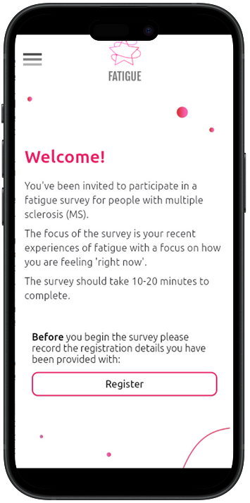
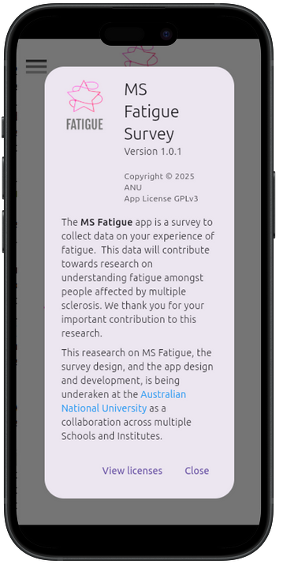
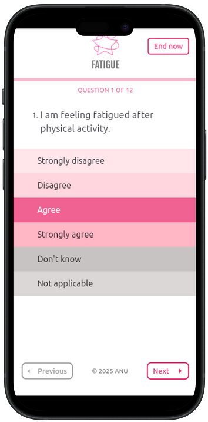
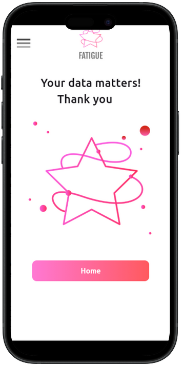

# Survey for MS Fatigue Assessment

MSFatigue is a demonstrator app designed to conduct surveys while
saving personal responses to the user's Pod hosted in their Data Vault
on any [Solid Server](https://solidproject.org/about) of choice. The
participant can then choose to share the survey results with the
researcher(s).  The results remain withthe participant, and could be
shared with other researchers in the future. The app was implemented
by the [ANU Software Innovation Institute](https://sii.anu.edu.au) and
written by [Zheyuan Xu](https://github.com/zheyxu) and [Graham
Williams](https://github.com/gjwgit) with design by Susan Hansen and
Michelle Pickrell.

If you appreciate the app then please show some ❤️ and star the [GitHub
Repository](https://github.com/anusii/msfatigue) to support the project.

The latest version of the app can be run online at
[msfatigue.solidcommunity.au](https://msfatigue.solidcommunity.au) with no
installation required, or downloaded and installed for your platform
from the [Solid Community AU](https://solidcommunity.au) repository:

+ **Android**
[apk](https://solidcommunity.au/installers/msfatigue.apk);
+ **GNU/Linux**
[snap](https://solidcommunity.au/installers/msfatigue_amd64.snap) or
[deb](https://solidcommunity.au/installers/msfatigue_amd64.deb) or
[zip](https://solidcommunity.au/installers/msfatigue-dev-linux.zip);
+ **macOS**
[dmg](https://solidcommunity.au/installers/msfatigue-dev-macos-unsigned.dmg) or
[zip](https://solidcommunity.au/installers/msfatigue-dev-macos.zip);
+ **Windows**
[zip](https://solidcommunity.au/installers/msfatigue-dev-windows.zip) or
[inno](https://solidcommunity.au/installers/msfatigue-dev-windows-inno.exe).

Contributions are welcome. Visit
[github](https://github.com/anusii/msfatigue) to submit an issue or,
even better, fork the repository yourself, update the code, and submit
a Pull Request. The app is implemented in
[Flutter](https://flutter.dev) using
[solidpod](https://pub.dev/packages/solidpod) for Flutter to manage
the Solid Pod interactions. Thank you.

## Introduction

On starting up the app you are greeted with the Welcome screen:

The About screen provides some of the background to the project:

Questions are presented, one question per screen, with the options for
the participant to choose the answer. The questions are sourced from a
markdown file, allowing the survey designers to easily update the
questions:

Once the survey has been completed you will be presented with the
Appreciation screen:

<!-- markdownlint-disable MD036 -->
*Time-stamp: <Wednesday 2025-10-29 15:48:39 +1100 Graham Williams>*
<!-- markdownlint-enable MD036 -->

<!-- markdownlint-disable MD053 -->
[comment]: # (Local Variables:)
[comment]: # (time-stamp-line-limit: -8)
[comment]: # (End:)
<!-- markdownlint-enable MD053 -->
